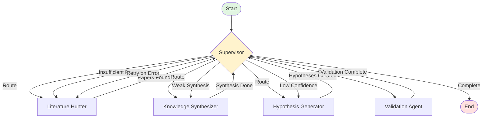

# HypothesisAI - Minimal LangGraph Workflow

## Essential Graph Structure (MVP)



## Core Components Only

### **Nodes (5 Essential)**

1. **Supervisor** (Conditional Router)
   - Makes all routing decisions
   - Checks quality thresholds
   - Handles retries
   - Determines completion

2. **Literature Hunter**
   - Searches for papers
   - Basic relevance scoring
   - Returns paper list

3. **Knowledge Synthesizer**
   - Identifies patterns
   - Finds research gaps
   - Creates synthesis summary

4. **Hypothesis Generator**
   - Generates novel hypotheses
   - Assigns confidence scores
   - Links to supporting papers

5. **Validation Agent**
   - Validates hypotheses
   - Checks feasibility
   - Final quality check

### **Edge Types**

#### **Static Edges** (Always flow back to Supervisor)
- `Literature Hunter → Supervisor`
- `Synthesizer → Supervisor`
- `Hypothesis Generator → Supervisor`
- `Validator → Supervisor`

#### **Conditional Edges** (Supervisor's routing decisions)
- `Supervisor → Literature Hunter` (if no papers or need more)
- `Supervisor → Synthesizer` (if have enough papers)
- `Supervisor → Hypothesis Generator` (if synthesis complete)
- `Supervisor → Validator` (if hypotheses generated)
- `Supervisor → End` (if validation complete or max retries)

## Simplified State Flow

```python
# Pseudocode for Supervisor routing logic
def supervisor_route(state):
    if not state.papers:
        return "literature_hunter"
    
    if len(state.papers) < MIN_PAPERS:
        return "literature_hunter"  # Get more
    
    if not state.synthesis:
        return "synthesizer"
    
    if not state.hypotheses:
        return "hypothesis_generator"
    
    if not state.validation_results:
        return "validator"
    
    return "end"  # Complete
```

## Why This Minimal Design Works

### **What We Keep:**
✅ **Supervisor-centric routing** - All decisions in one place
✅ **Complete research flow** - Papers → Synthesis → Hypotheses → Validation
✅ **Basic retry logic** - Can retry any step through Supervisor
✅ **Quality control** - Supervisor checks thresholds

### **What We Defer:**
❌ Parallel search (use single source for now)
❌ Multiple validators (one validation step)
❌ Methodology designer (can add later)
❌ Complex error handling (basic retry only)
❌ Human-in-the-loop (phase 2)
❌ Multiple output formats (just JSON initially)

## Implementation Priority

### **Phase 1 (This Graph):**
- Get basic flow working end-to-end
- Single literature source
- Simple synthesis
- Basic hypotheses
- Simple validation

### **Phase 2 Additions:**
- Add Methodology Designer node
- Add Quality Gate nodes
- Multiple literature sources
- Better error handling

### **Phase 3 Additions:**
- Parallel searches
- Human review node
- Multiple validators
- Output formatters

## Benefits of Starting Simple

1. **Quick to implement** - Can have working system fast
2. **Easy to debug** - Clear, simple flow
3. **Testable** - Each node has single responsibility
4. **Extensible** - Easy to add nodes later
5. **Complete** - Still does full research workflow

This minimal graph gives you a fully functional research system that you can start using immediately, then enhance iteratively!